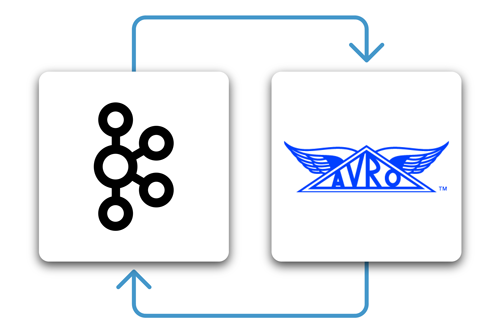
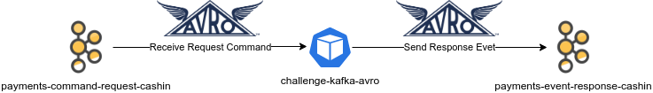

# challenge-kafka-avro

This challenge is to practice one of the most commons' data type when the subject is Apache Kafka.

> Avro is an open source data serialization system that helps with data exchange between systems,
> programming languages, and processing frameworks. 
> Avro helps define a binary format for your data, as well as map it to the programming language of your choice.
> Source: [Why Avro for Kafka Data?](https://www.confluent.io/blog/avro-kafka-data/?utm_medium=sem&utm_source=google&utm_campaign=ch.sem_br.nonbrand_tp.prs_tgt.kafka_mt.xct_rgn.latam_lng.eng_dv.all&utm_term=kafka%20avro&creative=&device=c&placement=&gclid=CjwKCAjwqIiFBhAHEiwANg9szjDgpBm2Qbc1mAbMm1Gkfd_iXTUe4gGOl84triPCJJTAqXZwS4vYTRoCoaoQAvD_BwE)

## Requirements

 - Docker
 - Java 11
 - Some IDE from your choice (Example made in IntelliJ)

## Architect Solution



## Objective

Create a producer and consumer in a Spring Boot application using Kafka AVRO has data type to receive and send _Events_.

## Context

Consider that your application need to process a thousand request per seconds, so is necessary to make this process asynchronous, in this case your solution architect suggest you to make an application to process those messages through two brokers, one to receive command witch will make payments requests and other to response the event that will make the payment process as well and generate a tracking ID at end.

## Help Commands

### Maven Commands

Request and Response avro are in `src/main/resources/avro`, so to generate AVRO Java Classes, from maven plugin, just execute:

```shell
mvn clean install
```

### Kafka Commands

First to send message to command topic, first is necessary to connect to **schema-registry** container:

```shell
docker exec -it schema_registry bash
```

After that, you can use command below:

 - Producer:
```shell
echo "{ \"message\": \"please buy a pizza\", \"amount\": 90, \"from_account\": { \"bank\": \"341\", \"number\": \"52142\", \"digit\": \"2\", \"branch\": \"1500\" }, \"to_account\": { \"bank\": \"341\", \"number\": \"23122\", \"digit\": \"9\", \"branch\": \"1500\" } }" | kafka-avro-console-producer --broker-list broker:19092 --property schema.registry.url=http://localhost:8081 --topic payments-command-request-cashout --property value.schema='{ "namespace": "br.com.tapajos.avro", "type": "record", "name": "RequestPayment", "fields": [ { "name": "message", "type": "string", "avro.java.string": "String" }, { "name": "amount", "type": "double" }, { "name": "from_account", "type": { "type": "record", "name": "Account", "fields": [ { "name": "bank", "type": "string" }, { "name": "number", "type": "string" }, { "name": "digit", "type": "string" }, { "name": "branch", "type": "string" } ] } }, { "name": "to_account", "type": "br.com.tapajos.avro.Account" } ] }'
```

After your solution, you will publish your event response in topic **payments-event-response-cashout**, that you can consume message using link below: 

- Consumer:

```shell
kafka-avro-console-consumer --bootstrap-server broker:19092 --from-beginning --topic payments-event-response-cashout --property schema.registry.url=http://localhost:8081
```